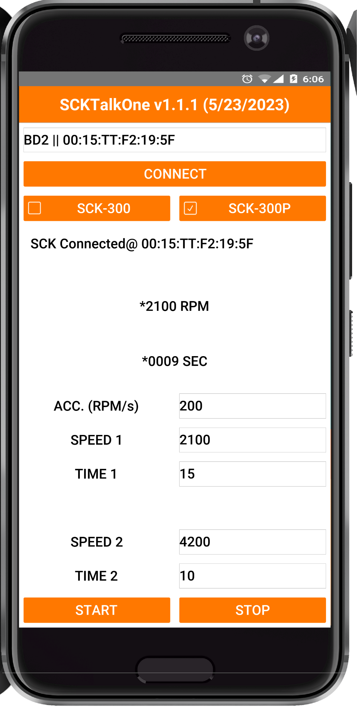
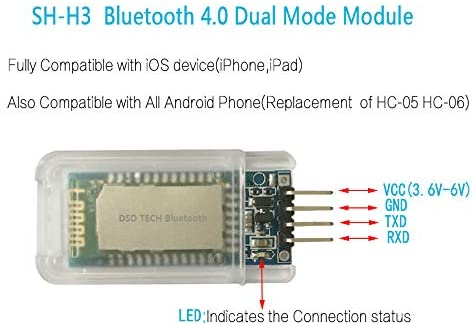

SCKTalkOne
=======

A simple [CodnameOne/Java](https://www.codenameone.com/) based Java application program demonstrating controlling the SCK-300 Spin Coater kits over a Bluetooth connection using an Andriod device. ***Please note that this code is provided for demonstration and testing purposes only, and comes with absolutely NO Warranty or Support of any kind. Use at your own risk***.

## Introduction

Every once in a while someone ask about controlling the SCK-300 kits remotely using a mobile device. Now, even though the use case for this is rather limited, and it likely makes more sense to use a commercial spin coater with this functionality instead, it's readily doable. All that's required is a Bluetooth to UART (TTL)  adapter, an understanding of the [SCK Communication API](https://gist.github.com/ns96/ef95fd06573a871adfa1c4bed21eef43) and how write an Andriod mobile application. Making use of these technologies makes for a fairly transparent process.

## Hardware

For a wireless connection, the [SH-H3 Bluetooth Dual Mode Module](https://www.amazon.com/gp/product/B072LX3VG1) 
can be used. All that's necessary is to change default baud rate to 19,200 according to the [user manual](http://www.dsdtech-global.com/2017/07/dsd-tech-sh-h3-bluetooth-dual-mode.html), and pair the device to the Andriod device. Once these steps are done connect the dupont header end of the USB Male A cable to it, and the USB end to the SCK-300 unit.

The USB cable's wire positions will need to be adjusted to match the UART adpater's 
(green->TX, white->RX, Red->Vcc, Black->Gnd).

## Installing and Running

In order to install the APK file on an Andriod device you must enable the ability to [install application from unknown sources]([How to Install Apps from Unknown Sources on Android - Make Tech Easier](https://www.maketecheasier.com/install-apps-from-unknown-sources-android/). 

1. Download the [SCKTalkOne-release.apk](https://github.com/ns96/SCKTalkOne/releases) and install it, making sure to allow the requested permissions.  
2. Run the SCKTalkOne application and sellect the SH-H3 bluetooth devise to pair to. 
3. Next press the "CONNECT" button. A message in the console area should indicate if connection to the SCK-300 base was successful.  The red LED on the SH-H3 unit should also stop blinking.  
4. Once connected, enter the desired Acceleration, Speed 1, and Time 1 values. Leave the Speed/Time 2 values at "0" if you don't want to ramp to a high speed, or set them if you do. Once ready, press the "START" button to start the SCK unit. The SCK unit will accelerate to the desired speed(s) and time then automatically stop.
5. Press the "STOP" button any anytime to stop the SCK unit.

